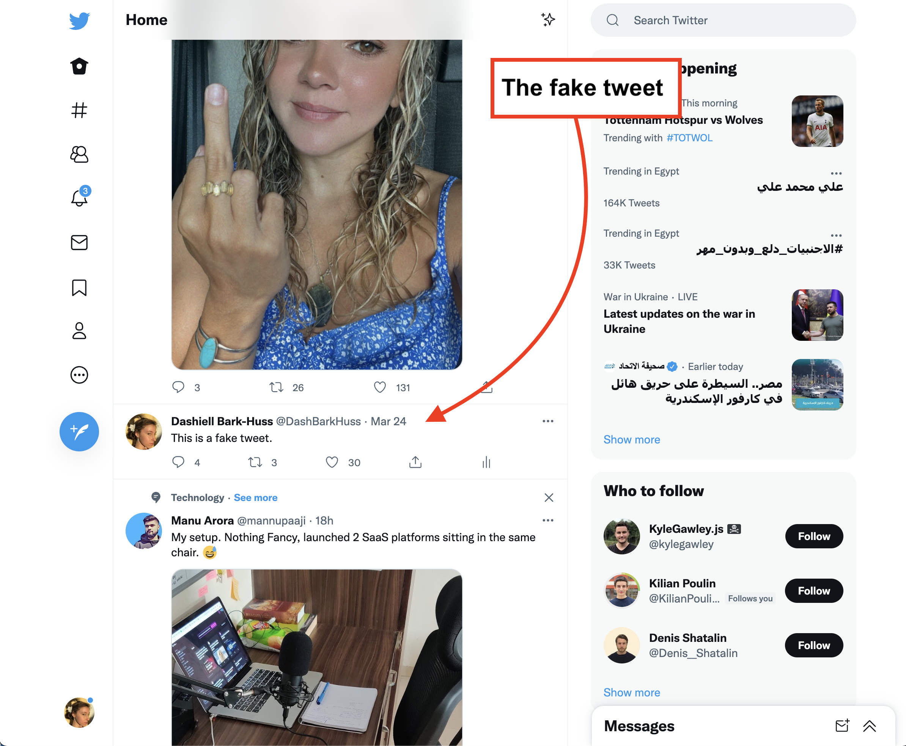

# faketweet



Current problems:
1. The MutationObserver will randomly slop working after a while. You can test to see if the mutation observer works by running in the console:

```javascript
const newDiv = document.createElement('div')
newDiv.setAttribute('id','newDiv')
 const timer = setTimeout(()=>{alert("mutation observer stopped working");
 },200)
   const callbackForAllChanges2 = function (mutationsList, observer) {
   if (mutationsList.find((record) => record.type === "childList")) {
       clearTimeout(timer);
      console.log("childList change");
    }
  };
// create mutation observer
 const allChanges2 = new MutationObserver(callbackForAllChanges2);


// attach mutation observer to document
```

The only way to fix the MutationObserver once it stop working is to quit chrome.

