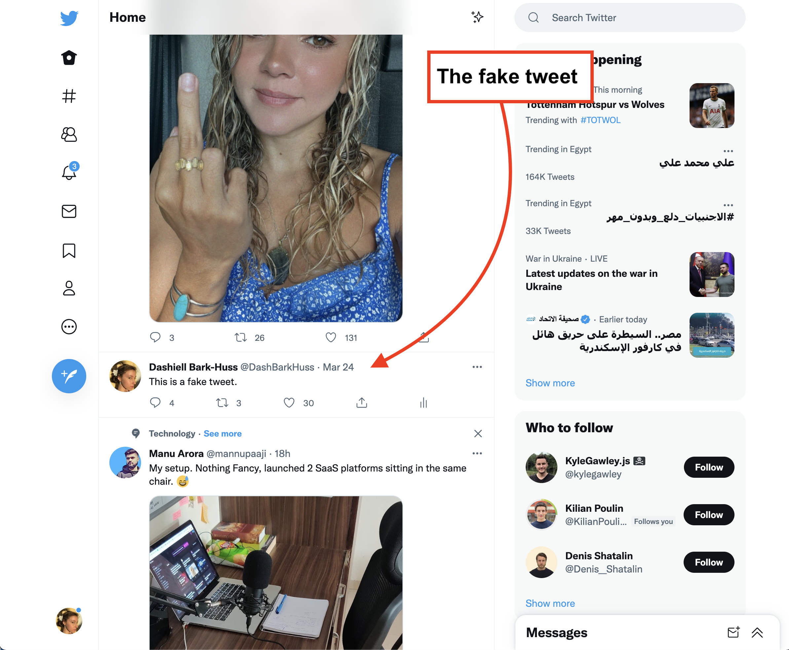

# faketweet



Current problems:

1. The MutationObserver will randomly slop working after a while.The only way to fix the MutationObserver once it stop working is to quit chrome.

I used to be able to run this code in the console on the browser to test if MutationObserver stopped working. But now this test code isn't working. It seems to be always triggering. But I'm leaving it here anyways for now.:

```javascript
const newDiv = document.createElement("div");
newDiv.setAttribute("id", "newDiv");
const timer = setTimeout(() => {
  alert("mutation observer stopped working");
}, 200);
const callbackForAllChanges2 = function (mutationsList, observer) {
  if (mutationsList.find((record) => record.type === "childList")) {
    clearTimeout(timer);
    console.log("childList change");
  }
};
// create mutation observer
const allChanges2 = new MutationObserver(callbackForAllChanges2);

// attach mutation observer to document
allChanges2.observe(newDiv, {
  childList: true,
  subtree: true,
});

// create new child
newDiv.appendChild(document.createElement("div"));
```

## Make a fake tweet

You can test this with other fake tweets. Grab the HTML from a tweet on Twitter.com following the instructions below.

<hr>

1. Find a tweet to copy
2. Inspect
3. Find the parent that has a transformY attribute within the inline style attribute. This parent div should have a bunch of siblings with transformY attributes also that each represent a different tweet. Copy the children of this parent div. This your template. You can edit it now, or edit it with dev tools and then copy it.
4. Add a new fake tweet on mongo atlas. Add the HTML under the field 'html'
5. optional: Add your screen name to 'addedBy' field.
